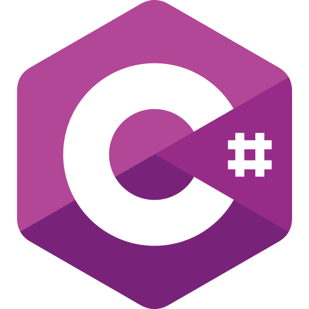

<!DOCTYPE html>
<html lang="en">
<head>
    <meta charset="UTF-8">
    <meta http-equiv="X-UA-Compatible" content="IE=edge">
    <meta name="viewport" content="width=device-width, initial-scale=1.0">
    <link rel="stylesheet" href="Styles/style.css">
    <link rel="icon" href="FaceVectorPortrait.png">
    <link rel="preconnect" href="https://fonts.googleapis.com">
<link rel="preconnect" href="https://fonts.gstatic.com" crossorigin>
<link href="https://fonts.googleapis.com/css2?family=Merriweather&family=Montserrat&family=Sacramento&display=swap" rel="stylesheet">
    <title>Dvbydt</title>
</head>
<body>
    
        
        

            
        

        

            <ul class="nav_ele">
                <li><a href="#profile">About</a></li>
                <li><a href="#skills">Skills</a></li>
                <li><a href="#contact">Contact Us</a></li>                 
            </ul>
        

    

    

        
        <h1>I'm Dhruv</h1>
        <h2 class="introh2">a Software Developer</h2>
        
               
    

    

        

          
          <h2>Hello.</h2>
          
I'm a person who loves solving problems be it code or in real life.

        

        

        

          <h2 id="skills">My Skills</h2>
          

            
            <h3>Java</h3>
            
I love solving Data Structures and Algorithm problems in Java.

          

          

            
            <h3>C#</h3>
            
I love developing games using C# and currently the projects that I'm working on are also in C#.

          

        

        

        

          <h2 >Get In Touch</h2>
          <h3>Let's build something!!!!</h3>
          
I will absolutely love to collaborate and work with you on something new and exciting.

          <a class="btn" href="mailto:name@email.com">CONTACT ME</a>
        

      

      
      
      

        <a class="footer-link" href="https://www.linkedin.com/">LinkedIn</a>
        <a class="footer-link" href="https://twitter.com/">Twitter</a>
        <a class="footer-link" href="https://www.appbrewery.co/">Website</a>
        
© Dhruv Vashist.

      

      

</body>
</html>
